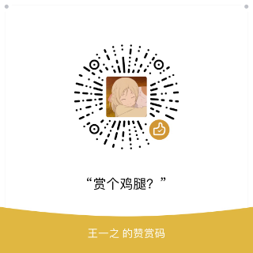

[](https://www.travis-ci.org/CodFrm/cxmooc-tools)


](https://img.shields.io/badge/chrome-success-brightgreen)
](https://img.shields.io/badge/firefox-success-brightgreen)
](https://img.shields.io/badge/tampermonkey-success-yellowgreen)


## 关于超星慕课小工具
> **[使用文档](https://cx-doc.xloli.top/)**

一个超星(学习通)和智慧树(知到)刷课工具,火狐,谷歌,油猴支持.全自动任务,视频倍速秒过,作业考试题库,验证码自动打码(੧ᐛ੭挂科模式,启动)

### 应用商店
[Chrome商店](https://chrome.google.com/webstore/detail/%E8%B6%85%E6%98%9F%E6%85%95%E8%AF%BE%E5%B0%8F%E5%B7%A5%E5%85%B7/kkicgcijebblepmephnfganiiochecfl?hl=zh-CN)
[FireFox商店](https://addons.mozilla.org/zh-CN/firefox/addon/%E8%B6%85%E6%98%9F%E6%85%95%E8%AF%BE%E5%B0%8F%E5%B7%A5%E5%85%B7/)
[greasyfork](https://greasyfork.org/zh-CN/scripts/376190-%E8%B6%85%E6%98%9F%E6%85%95%E8%AF%BE%E5%B0%8F%E5%B7%A5%E5%85%B7)

### 浏览器适配列表
 * [x] Chrome for PC
 * [x] Firefox for PC
 * [x] Firefox for Mobile
 * [x] QQ 浏览器 for PC
 * [x] Tampermonkey

### 功能支持列表
> 详情请看使用文档

* [x] 视频挂机
* [x] 视频秒过
* [x] 视频倍速
* [x] 静音播放
* [x] 任务答题
* [x] 自动阅读
* [x] 自动填写验证码
* [x] 考试答题
* [x] 作业答题

## 参与开发
> 如果你想参与开发,请阅读下面内容,如果只是使用本插件,请移步 **[使用文档](https://cx-doc.xloli.top/)**

### 环境:
* Node.js
* webpack

### Build
```bash
git clone https://github.com/CodFrm/cxmooc-tools.git
cd cxmooc-tools
npm install
npm run build
# 开发模式请使用
npm run dev
# 打包生成crx和油猴脚本
npm run pack
```

### Server
> 搭建了一个服务器程序用于完善题库。接口没有任何权限，只会记录正确答题答案,并不会记录其他信息。
> 以上过程全由插件自动提交,还请大家不要故意上传错误的答案哦 (๑• . •๑)
> 因为超星慕课全站启用了`https`,所以服务器配置需要`https`。

```bash
npm install
npm run server
```

### 贡献流程
1. `Fork Repo`
2. 发起`Pull Request`，并简要描述更改内容。
3. `Travis CI 检查通过`
4. `CodeReview`
5. 合并到项目仓库

## 题库
1. 题库大部分答案来源于用户答题后的页面采集,**所以需要有人第一次做过**,后来的人才能搜索到题目。
2. 可以配置随机题目,当题库中没有的题目则会自动随机选择一个选项
3. 考试题库收集,需要考试完毕后,进入考试答案页面,插件会自动收集.

题库记录提示:


## 关于反馈
您可以通过Issues反馈，反馈时请尽量提供足够明确的信息。

## 其他
GitHub项目地址:[https://github.com/CodFrm/cxmooc-tools](https://github.com/CodFrm/cxmooc-tools)

Blog地址:[http://blog.icodef.com/2018/01/25/1304](http://blog.icodef.com/2018/01/25/1304)

[telegram群组](https://t.me/joinchat/MHU8Gg2fP3Q51HLY2wqmQA)

[QQ群614202391](https://shang.qq.com/wpa/qunwpa?idkey=9bddd2564d84bd999940de422d1c0c70f87ecaf02fe9d7c60389fc2b376179eb)

## 赞助
微信扫一扫,赏个鸡腿?

[赞助列表](https://cx-doc.xloli.top/4-Reward/)



## 免责声明
本项目完全开源，免费，仅供技术学习和交流，**开发者团队并未授权任何组织、机构以及个人将其用于商业或者盈利性质的活动。也从未使用本项目进行任何盈利性活动。未来也不会将其用于开展营利性业务。个人或者组织，机构如果使用本项目产生的各类纠纷，法律问题，均由其本人承担。**

如果您开始使用本项目，即视为同意项目免责声明中的一切条款，条款更新不再另行通知。**开发者仅接受和捐赠者之间不构成购买或雇佣关系的捐赠或者赞赏。** 如果您选择捐赠此项目，我们会列出一份捐赠者名单（包含捐赠金额，日期），但不会公布您的捐赠账号。如果您选择捐赠，那么我将视之为您完全自愿的，没有任何雇佣，购买关系的捐赠。

The project is completely open source, free, and is for technical learning and communication only. **The developer team does not authorize any organization, organization, or individual to use it for commercial or profitable activities. Never use this project for any profitable activities. It will not be used for profit-making business in the future. Individuals or organizations and organizations that use the various disputes arising from the project and legal issues shall be borne by themselves.**

If you start using this project, you are deemed to agree to all the terms in the project disclaimer, and the terms are updated without further notice. **Developers only accept donations or appreciations that do not constitute a purchase or employment relationship with the donor.** If you choose to donate this item, we will list a list of donors (including donation amount, date), but will not announce your donation account. If you choose to donate, then I will treat you as completely voluntary, without any employment, donation of the relationship.