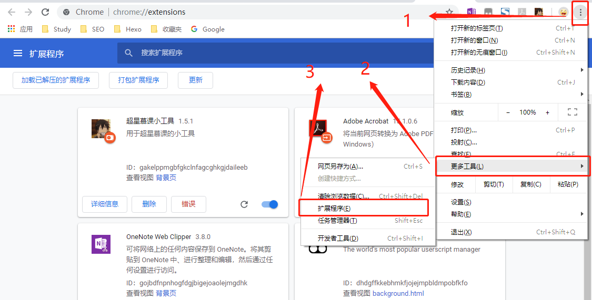
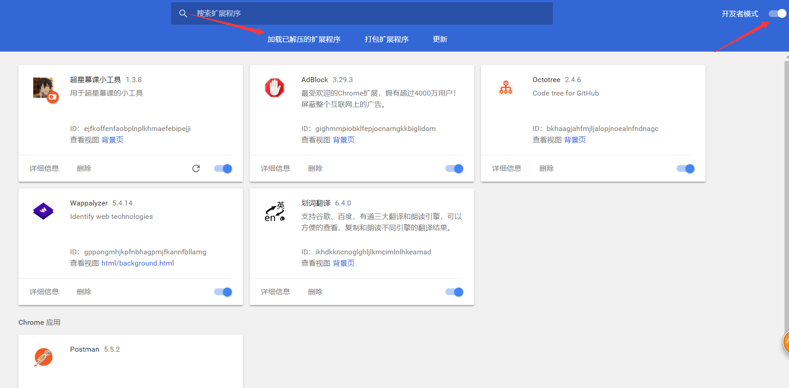

[](https://www.travis-ci.org/CodFrm/cxmooc-tools)


## 超星慕课小工具
> 一个快速学习超星慕课的chrome扩展工具(੧ᐛ੭挂科模式,启动)
> 
> 已经发布了一个属于油猴的脚本[油猴安装](#油猴安装)
> 
> 初次开发chrome扩展,有兴趣的朋友可以一起来哦，欢迎PR!

## 准备工作
> 如果你想参与开发,请阅读下面内容,如果只是使用本插件,请直接跳转到[安装](#安装)

### Build
环境:
* Node.js
* webpack

```bash
git clone https://github.com/CodFrm/cxmooc-tools.git
cd cxmooc-tools
npm install
npm run build
# 开发模式请使用
npm run dev
```

### Server
> 搭建了一个服务器程序,这个服务器用于完善题库。由于接口没有任何权限，所以只会记录你的正确答题答案,并不会记录你的其他个人信息。以上过程全由插件自动提交,还请大家不要故意上传错误的答案哦 (๑• . •๑)
> 
> 因为超星慕课全站启用了https,所以服务器配置需要https。

环境:
* Node.js
* Mongodb

```bash
npm install
npm run server
```

## 安装
### 油猴安装
> 油猴脚本只支持秒过,答题和单视频挂机功能,但是安装方便,相当于是一个小甜品吧~

地址链接:[https://greasyfork.org/zh-CN/scripts/376190-cxmooc-tools](https://greasyfork.org/zh-CN/scripts/376190-cxmooc-tools)

### 方法1:
> 能够体验到最新的功能,需要按照[准备工作](#准备工作)的方法步骤配置本地环境,可能会存在一些BUG。

1. 执行`npm run build`,此时会在`build/cxmooc-tools`目录下生成插件文件。
2. 打开Chrome浏览器的更多工具选项，打开扩展程序页面并启用开发者模式。
3. 加载已解压的扩展程序，路径选择`build/cxmooc-tools`

### 方法2(推荐):

下载发布的版本[cxmooc-tools.crx](https://github.com/CodFrm/cxmooc-tools/releases)无需安装环境,下载即可使用。

1. 下载发布的版本cxmooc-tools.crx文件，修改后缀为.zip，并将其解压到目录`cxmooc-tools`
2. 打开Chrome浏览器的更多工具选项，打开扩展程序页面并启用开发者模式。
3. 加载已解压的扩展程序，路径选择你解压的路径`cxmooc-tools/`

解压后`cxmooc-tools`目录应包含以下文件
```
.
├── img
|    └── some files
├── src
|    └── some files
└── manifest.json
```
**以Chrome浏览器为例:**




加载完成后，打开超星慕课的课程或者题目页面之后就可以正常使用了。

### 方法3:
下载[发布版本](https://github.com/CodFrm/cxmooc-tools/releases)cxmooc-tools.crx文件,直接拖入浏览器安装
某些浏览器允许直接拖入扩展进行安装。(内核为Chromium,如果不行,请按照方法2来)
支持列表

* [x] 360极速浏览器
* [x] QQ浏览器
* [ ] Chrome浏览器（无法启用）

...

## 说明
使用已安装扩展插件的浏览器打开超星慕课学习页面,在视频上方会显示相关功能按钮。扩展图标点击可展示配置项目,将鼠标放在配置项上可以看见配置详情。

油猴版本请打开源码查看,global.config中修改配置值

**秒过视频**功能可直接将视频看完,但是**有一定的风险**

插件功能:(勾为已实现的功能,空为将更新的内容)
* [x] 刷课挂机
* [x] 视频秒过
* [x] 视频加速
* [x] 视频静音
* [x] 自动答题
* [x] 自动阅读
* [ ] 视频内题目填充
* [ ] 考试答题

...


### 题库

关于题库,可以访问该页面:[https://github.com/CodFrm/cxmooc-tools/issues/16](https://github.com/CodFrm/cxmooc-tools/issues/16)

1. 不定期的更新题库文件,因为没有手动的去收集题目,所以大部分题目**需要有人第一次做过**,后来的人才能搜索到题目。
2. 可以配置随机题目,当题库中没有的题目则会自动随机选择一个选项

题库自动收集提示:


## 其他

GitHub项目地址:[https://github.com/CodFrm/cxmooc-tools](https://github.com/CodFrm/cxmooc-tools)

Blog地址:[http://blog.icodef.com/2018/01/25/1304](http://blog.icodef.com/2018/01/25/1304)

QQ群:[614202391](https://shang.qq.com/wpa/qunwpa?idkey=9bddd2564d84bd999940de422d1c0c70f87ecaf02fe9d7c60389fc2b376179eb)